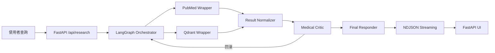

# 多代理醫學文獻助理（MARS）

本專案提供可擴充的多代理醫學文獻查詢工作流，結合 PubMed/Qdrant 工具封裝、LangGraph 狀態編排與 FastAPI 前後端服務，協助研究人員快速獲取臨床摘要、向量化儲存與決策支援。

## 目錄

1. [專案概述](#專案概述)
2. [系統架構摘要](#系統架構摘要)
3. [安裝與環境需求](#安裝與環境需求)
4. [環境變數設定](#環境變數設定)
5. [啟動方式](#啟動方式)
6. [測試與 CI](#測試與-ci)
7. [部署與品質守則](#部署與品質守則)
8. [Prompt 記錄](#prompt-記錄)
9. [專案現況與 Phase 追蹤](#專案現況與-phase-追蹤)

## 專案概述

- **多代理 Orchestrator**：透過 [`build_medical_research_graph()`](src/orchestrator/graph.py:1313) 建構 LangGraph 狀態機，串聯 Planner、Researcher、Librarian、Medical Critic 等節點以執行檢索、整理、審查與降級流程。
- **工具封裝**：利用 [`PubMedWrapper`](src/clients/pubmed_wrapper.py:32) 與 [`QdrantWrapper`](src/clients/qdrant_wrapper.py:73) 提供非同步 API 操作、錯誤分類與遙測統計，支援 rate limit 與向量資料維護。
- **FastAPI UI/API**：由 [`create_app()`](src/app/server.py:45) 啟動的 FastAPI 服務同時提供 `/api/research` streaming 端點與 Jinja UI 表單（`/ui`），前端以 NDJSON 事件流呈現代理進度。

## 系統架構摘要

整體流程依據 [`plans/phase4_langgraph_plan.md`](plans/phase4_langgraph_plan.md) 與 [`plans/phase5_ui_integration_plan.md`](plans/phase5_ui_integration_plan.md) 定義：



- **Orchestrator**：`LangGraphState` 透過條件邊控制 PubMed 空結果、Qdrant 健康度與 Medical Critic 回饋，必要時觸發 fallback。
- **資料層**：PubMed 檢索結果經正規化後寫入 Qdrant，並回補 RAG context；若 Qdrant 不可用則標記 degraded。
- **前端層**：`ui.partial_updates` 以 NDJSON 回送至 [`src/app/routes.py`](src/app/routes.py) 中的 streaming 端點，UI 以 SSE/Fetch API 解析。

## 安裝與環境需求

### 系統需求

- Python 3.11（建議）或 3.10（具降級邏輯）。
- 建議安裝 `pip`, `virtualenv`/`venv`。
- 選用：Docker、Docker Compose（啟動 Qdrant/Postgres）。

### 建立虛擬環境

```bash
python -m venv .venv
source .venv/bin/activate  # Windows 請改用 .venv\Scripts\activate
python -m pip install --upgrade pip
```

### 安裝依賴

- 若專案提供 `requirements.txt` 或 `pyproject.toml`，請先安裝：

  ```bash
  python -m pip install -r requirements.txt
  # 或
  python -m pip install -e .
  ```

- 尚未建立套件清單時，可參考 [`scripts/run_ci_checks.sh`](scripts/run_ci_checks.sh) 內的預設依賴：`fastapi`, `uvicorn[standard]`, `httpx`, `pytest`, `ruff`, `python-multipart`, `jinja2`, `pytest-asyncio`, `pytest-anyio`。

### Docker Compose（選用）

```bash
docker compose up -d qdrant postgres
```

指令會依 [`docker-compose.yml`](docker-compose.yml) 啟動 Qdrant（REST/GRPC）與 Postgres，並建立命名 volume 供資料持久化。

## 環境變數設定

1. 建議先複製 `.env`：

   ```bash
   cp .env.example .env
   ```

2. 主要變數摘要（詳見 [`.env.example`](.env.example)）：

| 類別 | 變數 | 說明 | 預設 |
| --- | --- | --- | --- |
| PubMed | `PUBMED_API_KEY` | PubMed E-utilities API 金鑰 | 空值（必填） |
| PubMed | `PUBMED_TOOL_NAME` / `PUBMED_EMAIL` | 符合 NCBI API 使用政策的識別資訊 | `mars-test-suite` / 空值 |
| Qdrant | `QDRANT_HOST` / `QDRANT_PORT` / `QDRANT_GRPC_PORT` | Qdrant 連線設定 | `localhost` / `6333` / `6334` |
| Qdrant | `QDRANT_COLLECTION` / `QDRANT_VECTOR_SIZE` | 預設 collection 與向量維度 | `mars-test` / `8` |
| Postgres | `POSTGRES_DB` / `POSTGRES_USER` / `POSTGRES_PASSWORD` / `POSTGRES_PORT` | 用於儲存查詢紀錄或後續擴充 | `mars` / `mars_admin` / `changeme` / `5432` |

> 若需 SSL、雲端外部服務或自訂 rate limit，請更新 `.env` 後重新啟動服務。

## 啟動方式

### 後端 FastAPI 伺服器

```bash
uvicorn src.app.server:create_app --factory --host 0.0.0.0 --port 8000 --reload
```

上述指令會載入 [`create_app()`](src/app/server.py:45)，啟動 API 與 UI。若未安裝 `langgraph`，將使用後備的 `FallbackCompiledGraph` 確保基礎流程仍可執行。

### 前端 / UI

- UI 位於 `/ui`，模板與靜態資源分別存放於 [`src/app/templates`](src/app/templates/index.html) 與 [`src/app/static`](src/app/static/main.css)。
- 使用者提交表單後呼叫 `/ui/query`，後端透過 [`api_research()`](src/app/routes.py:260) 與 [`ui_query()`](src/app/routes.py:280) 轉發至 Orchestrator。

### 其他腳本

- [`scripts/run_ci_checks.sh`](scripts/run_ci_checks.sh) ：建立虛擬環境、執行 linter、pytest、模板與遙測煙測，可作為本地 CI 或 pre-commit。

## 測試與 CI

- 單元與整合測試：

  ```bash
  pytest
  ```

- 端到端測試（包含 streaming 驗證）範例如 [`tests/test_app_e2e.py`](tests/test_app_e2e.py) 與 [`tests/test_orchestrator.py`](tests/test_orchestrator.py)。
- 推薦以 CI 腳本執行完整檢查：

  ```bash
  bash scripts/run_ci_checks.sh
  ```

  腳本同時執行 `ruff check`, `pytest`, FastAPI 模板載入與 Correlation ID 煙霧測試，確保 UI/API/Orchestrator 行為一致。

## 部署與品質守則

- 請參考部署計畫 [`plans/phase6_deployment_quality_plan.md`](plans/phase6_deployment_quality_plan.md) 的檢核表與 Mermaid 流程圖，重點包括：
  - 部署前檢查 `.env`、Secrets 管理與 Docker 容器健康檢查。
  - 版本標記與回滾策略（建議搭配 Git Tag 與容器映像）。
  - 觀測性：監控 `telemetry.error_flags`、`fallback.events` 與 `ToolCallMetric`，可延伸接入集中式告警。
  - QA 測試矩陣涵蓋成功 / 降級 / 失敗案例，確保符合 Phase 6 品質門檻。

## Prompt 記錄

- 所有提示工程與對話上下文整理於 [`PROMPT.md`](PROMPT.md)，方便追蹤模型互動歷程。

## 專案現況與 Phase 追蹤

| Phase | 狀態 | 摘要 |
| --- | --- | --- |
| Phase 0 – 基礎環境 | ✅ 已完成 | 專案骨架、設定模組與核心資料結構到位。 |
| Phase 1 – 外部資料管線 | ⏳ 未啟動 | 主線規劃尚待展開，預計納入更多醫學資料來源。 |
| Phase 2 – Schema 設計 | ✅ 已完成 | 依據 [`plans/phase2_schema_design.md`](plans/phase2_schema_design.md) 落實 `LangGraphState` 與遙測結構。 |
| Phase 3 – 工具封裝 | ✅ 已完成 | PubMed/Qdrant wrapper 與錯誤分類、速率限制、降級策略皆可用。 |
| Phase 4 – Orchestrator | ✅ 已完成 | LangGraph 工作流與 fallback 節點實作完成，並含回滾邏輯。 |
| Phase 5 – UI 與整合 | 🔄 進行中 | FastAPI UI/Streaming 已可用，仍持續強化觀測性與 UX。 |
| Phase 6 – 部署與品質 | 🚧 規劃中 | 依部署計畫彙整檢查清單、回滾策略與觀測方案；待進一步實作。 |

---

如需更多細節，請參考設計文件 [`DESIGN.md`](DESIGN.md) 與各 Phase 計畫稿。歡迎於 Issue/PR 中回報改進建議與部署回饋。
