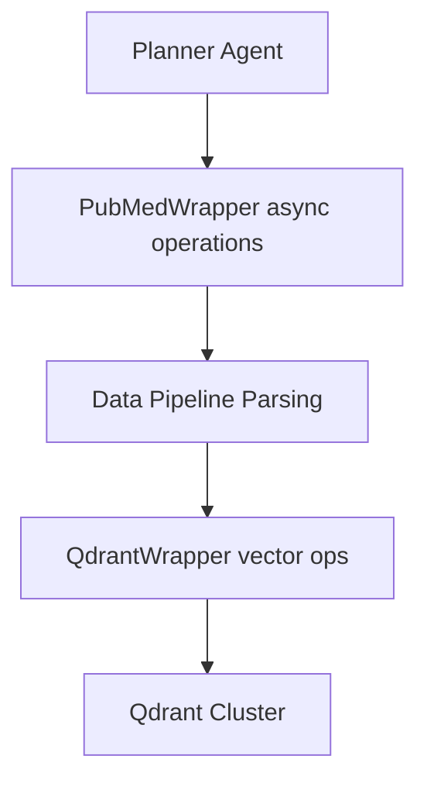

# Phase 3 工具封裝設計藍圖

## 1. 規格導出與需求追蹤
- 根據資料流動與模組邊界需求 [`DESIGN.md`](../DESIGN.md:15-33)，封裝層需串接 `External API (PubMed)` 與 `Qdrant Vector`，並與資料流水線保持鬆耦合。
- 工程規範要求非同步、模組去耦與防禦性編程 [`DESIGN.md`](../DESIGN.md:49-52)，故封裝必須採用 asyncio、集中錯誤處理與降級策略。
- Tool 等級元件須具備測試覆蓋 [`DESIGN.md`](../DESIGN.md:52)，規格中需列出可測試的公開介面與錯誤案例。

## 2. 共同設計原則
1. **非同步優先**：所有 I/O 透過 `async` 介面實作，允許 orchestrator 並行調度。
2. **明確輸入輸出契約**：公開方法回傳結構化資料（Pydantic/BaseModel 或 dataclass），含原始來源、解析結果與錯誤狀態旗標。
3. **集中錯誤分類**：定義抽象基底 `ToolingError` 與專屬子類別，便於上層捕捉。
4. **可觀測性**：統一注入 `structlog` 或 OpenTelemetry logger/span，保留 request-id 與 query metadata。
5. **可配置性**：依環境載入（.env 或設定檔）控制 endpoint、timeout、Rate Limit、重試策略。
6. **降級策略**：在外部資源不可用時提供退讓（返回快取、停用寫入、回傳警告 payload）。

## 3. [`PubMedWrapper`](../DESIGN.md:31-33) 設計

### 3.1 類別職責
- 提供 PubMed E-utilities (esearch, efetch, esummary) 非同步存取。
- 負責請求排程、Rate Limit 與重試，將 XML/JSON 解析成標準化文獻結構。
- 與資料流水線透過純資料物件交互，不耦合清洗/切片邏輯。

### 3.2 初始化參數
- `async_client: httpx.AsyncClient`：支援連線池與逾時設定。
- `rate_limiter: AsyncRateLimiter`：Token bucket 或 leaky bucket 實作。
- `api_key: str | None`：若提供則提高 NCBI 限額。
- `tool_name: str` & `email: str`：符合 NCBI usage policy 以便追蹤。
- `max_retries: int`、`retry_backoff: tuple[float, float]`：防禦性重試。
- `logger: structlog.BoundLogger | None`。

### 3.3 公開非同步方法
- `async search(query: PubMedQuery) -> PubMedSearchResult`
- `async fetch_details(ids: list[str], *, rettype: str, retmode: str) -> PubMedBatch`
- `async fetch_summaries(ids: list[str]) -> list[PubMedSummary]`
- `async warm_up() -> None`：預熱 client 與 rate limiter。

### 3.4 私有協助方法
- `_build_params(endpoint: str, payload: dict[str, str]) -> dict[str, str]`
- `_handle_response(response: httpx.Response, expected: str) -> bytes`
- `_throttle()`：封裝 rate limiter acquire/release。
- `_parse_xml(raw: bytes) -> PubMedBatch`

### 3.5 Rate Limit 策略
- 預設限制：不帶 API key 時 `3 req/sec`，帶 API key 時 `10 req/sec`。
- 實作：
  - 採用 `asyncio.Semaphore` + 高精度計時或引入 `aiolimiter`。
  - 以滑動視窗紀錄最近請求時間戳，避免爆量突發。
  - 逾期請求會排入等待隊列，超過 `rate_limit_timeout` 時拋出 `PubMedRateLimitError`。

### 3.6 錯誤分類與回傳格式
- `PubMedError(ToolingError)`：基底類，包含 `request_id`、`status_code`、`detail`。
- 子類：
  - `PubMedRateLimitError`
  - `PubMedHTTPError`
  - `PubMedParseError`
  - `PubMedEmptyResult`
- 回傳模型欄位：`data`, `raw`, `warnings`, `metrics`（RTT、重試次數）、`source`。

### 3.7 日誌與監控
- 於每次呼叫將 `query_terms`, `ids`, `latency`, `retry_count`, `rate_limit_wait` 綁定至 logger。
- 透過 OpenTelemetry span 記錄外部 API 依賴，並發送指標：成功率、429/5xx 次數。
- 匯出 rate limiter 狀態至 Metrics（例如 Prometheus async exporter）。

### 3.8 測試建議
- 使用 pytest-asyncio 模擬 httpx transport，覆蓋成功、Rate Limit、429 重試、解析錯誤。
- 以 VCR.py 或 respx 錄製代表性回應，確保持久化測試。

## 4. [`QdrantWrapper`](../DESIGN.md:31-33) 設計

### 4.1 類別職責
- 管理 Qdrant 連線、collection schema 驗證與 CRUD。
- 提供同步與異步檢索接口，支援 Hybrid Search（向量 + payload 過濾）。
- 保證資料一致性與批次 upsert 成功回報。

### 4.2 初始化參數
- `client: AsyncQdrantClient`（官方 `qdrant-client`）。
- `collection: str`：目標 collection 名稱。
- `vector_size: int`、`distance: str`：啟動時驗證 schema。
- `payload_schema: dict[str, type | SchemaValidator]`：欄位型別約束。
- `max_batch_size: int`、`timeout: float`、`consistency: Literal["weak","medium","strong"]`。
- `logger: structlog.BoundLogger | None`。

### 4.3 公開非同步方法
- `async ensure_collection(config: CollectionConfig) -> None`
- `async upsert(records: Sequence[QdrantRecord]) -> QdrantUpsertResult`
- `async query(request: QdrantQuery) -> QdrantQueryResult`
- `async delete(point_ids: Sequence[str]) -> QdrantDeleteResult`
- `async healthcheck() -> QdrantHealthStatus`

### 4.4 私有協助方法
- `_validate_schema()`：啟動時檢查 collection 設定。
- `_chunk_records(records) -> Iterable[Sequence[QdrantRecord]]`。
- `_map_exception(exc: Exception) -> QdrantError`。

### 4.5 錯誤分類與降級
- `QdrantError(ToolingError)` 基底，含 `operation`, `collection`, `detail`。
- 子類：`QdrantConnectivityError`, `QdrantSchemaError`, `QdrantConsistencyError`, `QdrantTimeoutError`。
- 降級策略：
  - Upsert 失敗可回傳部分成功記錄與失敗明細。
  - Query 失敗回傳最近快取結果與 warning。
  - 健康檢查若失敗回傳 `degraded` 狀態，促使 orchestrator 切換策略。

### 4.6 日誌與監控
- 於操作前後記錄 `collection`, `vector_count`, `conditions`, `took_ms`, `retry_count`。
- 導出 Qdrant 指標（寫入吞吐、延遲、失敗率），可整合 OpenTelemetry metrics exporter。
- 針對批次 upsert 追蹤單筆失敗率，以便警示資料品質。

### 4.7 測試建議
- 使用 `pytest-asyncio` 與 `qdrant-client` 的 in-memory/mock server。
- 覆蓋 schema 驗證、批次 upsert、payload 過濾、部分失敗。

## 5. 配置與依賴建議
- 依賴：`httpx[http2]`, `qdrant-client[grpc]`, `pydantic`, `aiolimiter`, `tenacity`, `structlog`, `opentelemetry-sdk`。
- 設定檔：
  - `.env` 或 `config/tooling.yaml` 儲存 API key、endpoint、Rate Limit、batch 大小。
  - 使用 `pydantic-settings` 建立 `ToolingSettings`，注入 wrappers。
- 測試需求：新增 `tests/tools/test_pubmed_wrapper.py`、`tests/tools/test_qdrant_wrapper.py`。

## 6. 實作注意事項與未決議題
- NCBI 要求每次請求附帶 `tool` 與 `email` 參數；需確認是否統一由設定載入。
- 確認資料流水線對 XML 解析輸入格式需求（原始 bytes 或 ElementTree）。
- Hybrid Search 需定義 metadata 篩選語法（一致的欄位命名與型別）。
- 決定是否加入本地快取層（如 Redis）以緩解 PubMed 重複查詢。
- 需確認 Qdrant 集群在 Phase 1 設定的 `replication_factor` 與 `shard_number`，以便 wrapper 健康檢查。

## 7. Mermaid：工具互動概觀

