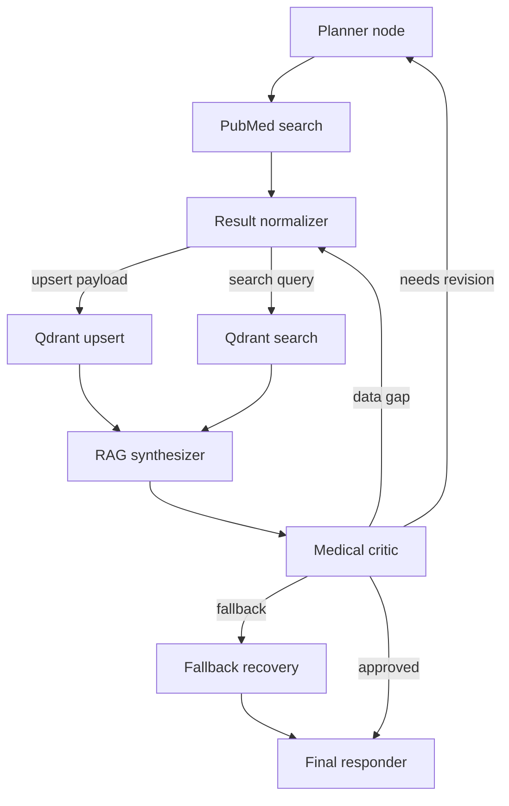

# Phase 4 LangGraph 狀態機規劃草案

## 1. Phase 3 工具特性與代理協作重點
- PubMed 工具封裝採用全非同步介面與 `AsyncRateLimiter`，提供搜尋、摘要抓取、預熱，並以 `PubMedError` 階層分類錯誤，包含 `PubMedEmptyResult` 與 Rate Limit 退讓 [`plans/phase3_wrapper_design.md`](plans/phase3_wrapper_design.md:31-110)。
- Qdrant Wrapper 透過 `AsyncQdrantClient` 確保 collection schema 驗證、批次 upsert 與混合檢索，遇到部分失敗會回傳降級結果並標示警示訊息 [`plans/phase3_wrapper_design.md`](plans/phase3_wrapper_design.md:68-110)。
- Agent 覆蓋角色：Planner 進行任務拆解與關鍵字規劃，Researcher 操作 PubMed 工具，Librarian 管控 Qdrant upsert / search，Medical Critic 審查與名詞釐清，彼此透過 LangGraph 之狀態物件共享上下文 [`DESIGN.md`](DESIGN.md:20-33)。
- 錯誤訊號與降級策略：PubMed 非同步操作具備 rate limit 退讓與空集合錯誤，Qdrant 包含健康檢查失敗時的 degraded 標記，可供 LangGraph 條件分支使用 [`plans/phase3_wrapper_design.md`](plans/phase3_wrapper_design.md:44-106)。

## 2. LangGraphState 欄位結構草案
| 區域 | 欄位 (型別) | 說明 |
| --- | --- | --- |
| 使用者輸入 | `user_query.raw_prompt: str` `user_query.normalized_terms: list[str]` `user_query.constraints: dict[str, Any]` | 原始提問、Planner 正規化後的關鍵詞與條件（日期範圍、族群、研究類型）。
| 規劃進度 | `planning.iteration: int` `planning.plan_steps: list[PlanStep]` `planning.status: Literal["pending","running","succeeded","degraded","failed"]` | Planner current iteration counter、既定子任務、整體狀態旗標。
| PubMed 檢索 | `pubmed.latest_query: PubMedQuery` `pubmed.query_history: list[PubMedQueryLog]` `pubmed.results: list[PubMedDocument]` `pubmed.empty_retry_count: int` | 追蹤最近一次關鍵字組合、重試紀錄、累積文獻結果與空集合次數。
| Qdrant 狀態 | `qdrant.collection_ready: bool` `qdrant.upsert_metrics: list[BatchTelemetry]` `qdrant.search_results: list[VectorHit]` `qdrant.health: Literal["healthy","degraded","unavailable"]` | 確保 collection 已準備、upsert 批次耗時與失敗率、檢索命中與健康度。
| RAG 合成 | `rag.context_bundle: list[ContextChunk]` `rag.synthesis_notes: list[str]` `rag.answer_draft: str | None` | 整理後的 chunk、合成提示備註與草稿回答。
| 臨床審查 | `critic.findings: list[CriticFinding]` `critic.trust_score: float` `critic.revision_required: bool` | 審查發現、可信度評分、是否需回滾旗標。
| 遥測與健康 | `telemetry.tool_invocations: list[ToolCallMetric]` `telemetry.active_tasks: dict[str, TaskStatus]` `telemetry.error_flags: list[ErrorSignal]` | 收集工具延遲、非同步任務狀態、錯誤訊號供分支判斷。
| 降級紀錄 | `fallback.events: list[FallbackEvent]` `fallback.terminal_reason: str | None` | 記錄啟動的降級策略與最終終止原因。
| UI 與串流 | `ui.stream_anchor: str` `ui.partial_updates: list[StreamUpdate]` | 追蹤 UI streaming 位置與暫存輸出，避免阻塞。
| 擴充保留 | `extensions: dict[str, Any]` | 留給未來代理或工具的擴充欄位。

> 建議以 Pydantic BaseModel 或 TypedDict 實作 `LangGraphState`，子結構如 `PlanStep`, `PubMedQueryLog`, `ToolCallMetric` 應定義在 `src/orchestrator/schemas.py` 以共用類型。

## 3. 主要節點職責與輸入輸出
1. **Planner Node**：讀取 `user_query.*` 與 `telemetry.error_flags`，輸出更新後的 `planning.plan_steps`、`pubmed.latest_query` 以及重設重試計數，當偵測 Scenario A/B 觸發時修改 `fallback.events`。
2. **PubMed Search Node (Researcher)**：依照 `pubmed.latest_query` 非同步呼叫 PubMed Wrapper，將結果寫入 `pubmed.results` 與 `pubmed.query_history`，若回傳空集合則遞增 `pubmed.empty_retry_count` 並推送 `telemetry.error_flags`。
3. **Result Normalizer**：將 PubMed 文獻解析為 RAG chunk，更新 `rag.context_bundle` 與 `qdrant.upsert_metrics` 所需的 payload。
4. **Qdrant Upsert Node (Librarian)**：將新 chunk upsert，更新 `qdrant.upsert_metrics`，若健康狀態不佳則寫入 `qdrant.health` 與 `fallback.events`。
5. **Qdrant Search Node**：根據最新 query 在 Qdrant 進行相似度檢索，更新 `qdrant.search_results` 與 `rag.context_bundle`。
6. **RAG Synthesizer Node**：整合檢索上下文與 `planning.plan_steps` 產出 `rag.answer_draft` 與 `rag.synthesis_notes`，同時更新 `ui.partial_updates`。
7. **Medical Critic Node**：審查 `rag.answer_draft` 與 `rag.context_bundle`，寫入 `critic.findings`、`critic.trust_score`，決定是否將 `critic.revision_required` 設為 True 并提供回滾指示。
8. **Fallback/Recovery Node**：根據 `telemetry.error_flags` 與 `fallback.events` 決定啟動降級策略（例如使用快取、提示終止），更新 `fallback.terminal_reason`。
9. **Final Responder Node**：生成最終回應，整合 `rag.answer_draft` 與 `critic.findings`，將結果寫入 `ui.partial_updates` 與 `telemetry.tool_invocations` 終止標記。

## 4. Conditional Edge 設計
- **Scenario A (PubMed 空集合)**
  - 邊 1：`PubMed Search -> Planner` 當 `pubmed.empty_retry_count <= threshold` 時，由 Planner 重新優化關鍵字（擴增同義詞、調整年份）並更新 `pubmed.latest_query`。
  - 邊 2：`Planner -> Fallback/Recovery` 當 `pubmed.empty_retry_count > threshold` 或 `telemetry.error_flags` 多次記錄 `PubMedEmptyResult` 時，啟動降級（例如改用 Qdrant 舊資料或直接告知無結果），並將 `fallback.terminal_reason` 設定為 `pubmed-no-result`。
  - 邊 3：`Fallback/Recovery -> Final Responder` 當降級策略成功或決定終止時，帶著警示訊息完成任務。

- **Scenario B (Medical Critic 可信度不足)**
  - 邊 1：`Medical Critic -> RAG Synthesizer` 當 `critic.revision_required` 且問題在內容組織，可回滾至合成節點要求補充引用或加上懸殊提示。
  - 邊 2：`Medical Critic -> Result Normalizer` 當缺乏資料依據時，回滾至資料整理節點以擴充 chunk 選取或重新挑選來源。
  - 邊 3：`Medical Critic -> Planner` 當規劃本身缺關鍵研究時，要求 Planner 重新展開子任務並更新 `planning.plan_steps`。
  - 邊 4：`Medical Critic -> Fallback/Recovery` 若多次回滾仍未改善可信度，將結果標記為 `critic-failed-validation` 並走降級流程。
  - 所有回滾邊均需攜帶 `critic.findings` 與建議，寫入 `telemetry.error_flags` 供後續節點決策。

## 5. 非同步工具串接策略
- PubMed Search 與 Qdrant Upsert/Search 以 `asyncio.gather` 並行執行：`PubMed` 輸出資料後觸發 `Result Normalizer`，於 RAG 前再並行啟動 `Qdrant Upsert` 與 `Qdrant Search`，UI 層擷取 `ui.partial_updates` 進行 streaming。
- 工具呼叫結束需更新 `telemetry.tool_invocations`（包含開始/結束時間、例外類型）。若某任務逾時，將狀態記錄於 `telemetry.active_tasks` 并由 Fallback 判斷是否取消。
- 使用 `asyncio.TaskGroup` 包裝長時操作，並於 state 中記錄 `task_id`，讓 UI 可顯示進度並避免阻塞。
- Fallback 節點負責監控 `telemetry.active_tasks`，發現卡住時可取消任務與回報 UI。

## 6. 流程摘要與圖示草稿
- 順序：`Planner -> PubMed Search -> Result Normalizer -> Qdrant Upsert` 與 `Qdrant Search` 並行 -> `RAG Synthesizer -> Medical Critic -> (回滾或繼續) -> Fallback/Recovery -> Final Responder`。
- Mermaid 草稿：

- 圖示中邊標示可依實作調整，避免在方框內使用雙引號或括號已符合解析限制。

