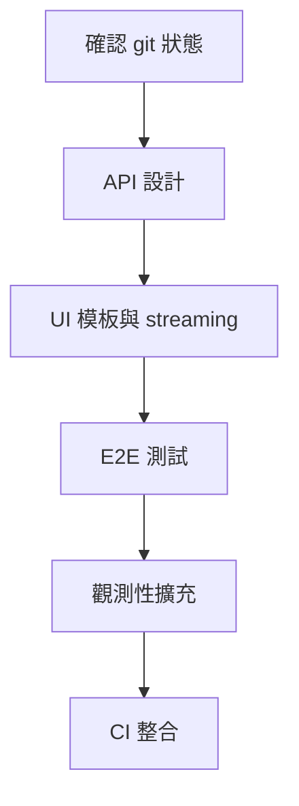

# Phase 5 UI 與端到端整合規劃

## 1. Phase 5 範疇摘要
- 使用者體驗與互動層：提供流式回應、關鍵步驟提示與觀測資訊，對應 MARS 互動介面需求 [`DESIGN.md`](DESIGN.md:18-41)。
- 完整端到端流程驗證：涵蓋 PubMed 檢索至最終回應，確保 LangGraph 流程與資料管線協同運作 [`src/orchestrator/graph.py`](src/orchestrator/graph.py:331-1205)。
- 觀測性與遙測整合：重用現有的 `telemetry` 管線，將前端互動事件與 Orchestrator 指標串聯 [`src/orchestrator/schemas.py`](src/orchestrator/schemas.py:256-329)。

### Phase 5 目標
1. 建立後端內嵌的簡易 UI（FastAPI + Jinja）以展示 agent 運作流程。
2. 將 UI 與 Orchestrator API 串接，支援查詢觸發、結果 streaming、錯誤回饋。
3. 實作端到端測試策略，覆蓋成功與降級場景，整合 CI。
4. 擴充觀測性，串聯 UI 層與現有遙測資料以支援偵錯。

## 2. 可重用模組與 Phase 5 角色定位
| 元件 | 來源 | Phase 5 角色 |
| --- | --- | --- |
| LangGraph Orchestrator | [`src/orchestrator/graph.py`](src/orchestrator/graph.py:331-1205) | 提供核心狀態流程與 streaming partial updates，供 UI 顯示。
| Orchestrator Schemas | [`src/orchestrator/schemas.py`](src/orchestrator/schemas.py:206-329) | 提供 UI API 回傳資料結構 (e.g. `StreamUpdate`, `TelemetryState`)。
| PubMed/Qdrant Wrappers | [`src/clients/pubmed_wrapper.py`](src/clients/pubmed_wrapper.py:32-546), [`src/clients/qdrant_wrapper.py`](src/clients/qdrant_wrapper.py:73-816) | 透過 Orchestrator 觸發，不需改動但端到端測試需假資料或 mock。
| 測試基礎 | [`tests/test_orchestrator.py`](tests/test_orchestrator.py:1-219), [`tests/test_connectivity.py`](tests/test_connectivity.py:1-254) | 提供 fake stubs 與降級案例，可延伸為 UI 端到端測試的 fixture。
| 設定模組 | [`src/settings.py`](src/settings.py:1-31) | 擴充以載入 UI 或 API 相關設定。

## 3. 工作拆解與交付要求

### 3.1 前端整合與介面層
- **任務**：建立 FastAPI route 與 Jinja 模板，顯示搜尋表單、進度指示與最終回答。
- **模式建議**：code。
- **預期產出**：
  - `/ui` GET route 供頁面載入。
  - `/ui/query` POST route 向 Orchestrator API 發送請求，採用 SSE 或輪詢呈現 `StreamUpdate`。
  - 基於 Tailwind 或簡易 CSS 的模板，反映錯誤旗標、降級訊息。
- **前置條件**：確認 FastAPI 應用與靜態資源載入配置 (Phase 0)、整理 streaming API 回應格式。
- **驗收準則**：在本機啟動服務後，能輸入查詢並看到逐步更新與最終結果，錯誤情境顯示提示。

### 3.2 Orchestrator 與前端 API 交互
- **任務**：設計 `/api/research` (POST) 端點，回傳 streaming 或 chunked JSON；整理狀態映射以供 UI 顯示。
- **模式建議**：code。
- **預期產出**：
  - FastAPI endpoint 觸發 `build_medical_research_graph`，並轉換 `StreamUpdate` 為 SSE。
  - 定義 DTO/response schema，確保 UI 可解析 `telemetry.error_flags`、`fallback.events`。
- **前置條件**：審視 Orchestrator fallback 分支與 streaming 實作 [`src/orchestrator/graph.py`](src/orchestrator/graph.py:331-1205)。
- **驗收準則**：撰寫 API 單元測試/整合測試，確認成功與降級情境回傳結構一致。

### 3.3 端到端測試策略
- **任務**：定義 pytest-based E2E 測試，利用 httpx.AsyncClient 對 FastAPI 測試應用呼叫。
- **模式建議**：code + debug。
- **預期產出**：
  - 測試案例：成功流程 (使用 stub wrappers) 與降級流程 (缺 Qdrant 或 PubMed 空結果)。
  - mock fixture：重用 [`tests/test_orchestrator.py`](tests/test_orchestrator.py:49-218) 內 stub 類別，包裝為 pytest fixture。
  - CI 配置：更新 `pytest` 指令包含 E2E 測試標籤，若有 GitHub Actions 則增列工作步驟。
- **前置條件**：建立可注入的依賴容器，允許測試替換 wrappers。
- **驗收準則**：E2E 測試可在無外部服務時通過；CI 無新增 flakiness。

### 3.4 觀測性與記錄擴充
- **任務**：將 UI 互動事件連結 Orchestrator telemetry，提供除錯儀表資訊。
- **模式建議**：code。
- **預期產出**：
  - 在 UI 發送請求時記錄 correlation ID，並注入至 Orchestrator `StreamUpdate.metadata` 或 `telemetry.tool_invocations`。
  - 建立簡易前端 console logger 或 telemetry 面板，顯示 `error_flags` 與進度。
  - 擴充 logging 設定，確保 structlog 或標準 logger 输出 JSON 格式便於匯聚。
- **前置條件**：審視現有遙測結構 [`src/orchestrator/schemas.py`](src/orchestrator/schemas.py:256-329)。
- **驗收準則**：可在 UI 或 log 中追蹤單次請求完整流程，包含降級原因。

### 3.5 Git 與工作區狀態檢查
- **任務**：在進入 Phase 5 coding 模式前，確認 Phase 0-4 變更已提交並工作區乾淨。
- **模式建議**：ask。
- **預期產出**：
  - 若 `git status` 顯示未提交檔案，先整理 commit。
  - 文件註記 Phase 5 需基於乾淨分支展開。
- **前置條件**：執行 `git status`。
- **驗收準則**：計畫中明確標注此要求（如本節）。

## 4. 時程與依賴關係概覽

## 5. 後續行動建議
1. 與團隊確認 FastAPI 服務部署方式與可接受的 streaming 格式 (SSE 或 WebSocket)。
2. 核對 Phase 4 測試覆蓋率與 stub，決定是否抽象化為共享 fixture 模組。
3. 在 coding 模式開始前，建立 `phase5-ui-integration` 分支並同步主分支。
4. 規劃前端使用者流程（輸入、進度、結果、錯誤）並以 wireframe 記錄，確保實作一致。

