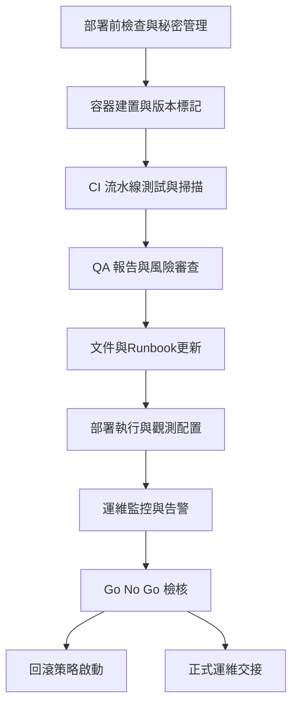

# Phase 6 部署準備與品質審查規劃

## 1. 部署與品質要求摘錄
| 來源 | 關鍵要求 |
| --- | --- |
| [`DESIGN.md`](../DESIGN.md:47-56) | 強制非同步通訊、防禦性編程、Rate Limit、降級策略、完整自動化測試 |
| [`plans/phase4_langgraph_plan.md`](phase4_langgraph_plan.md:17-53) | 定義 `telemetry.error_flags`, `fallback.events`, `ToolCallMetric` 觀測欄位與回滾節點行為 |
| [`plans/phase5_ui_integration_plan.md`](phase5_ui_integration_plan.md:5-63) | Streaming NDJSON API/ UI 串流需求、E2E 測試、遙測擴充 |
| [`plans/phase3_wrapper_design.md`](phase3_wrapper_design.md:8-118) | 工具封裝錯誤分類、遙測、依賴與設定檔需求 |

## 2. 現有資產盤點
| 類別 | 現況 | 參考 |
| --- | --- | --- |
| Orchestrator 與狀態機 | LangGraph pipeline 與回滾策略完整 | [`src/orchestrator/graph.py`](../src/orchestrator/graph.py:1-400) / [`src/orchestrator/schemas.py`](../src/orchestrator/schemas.py:40-329) |
| API 與 UI | Streaming NDJSON API、UI 表單與 SSE | [`src/app/routes.py`](../src/app/routes.py:244-299) |
| 工具封裝 | PubMed/Qdrant wrappers、錯誤類型與降級策略 | [`src/clients/pubmed_wrapper.py`](../src/clients/pubmed_wrapper.py:1-546) / [`src/clients/qdrant_wrapper.py`](../src/clients/qdrant_wrapper.py:1-816) |
| 測試 | 單元、整合、E2E、降級場景覆蓋 | [`tests/test_orchestrator.py`](../tests/test_orchestrator.py:1-218) / [`tests/test_app_e2e.py`](../tests/test_app_e2e.py:118-233) |
| CI 腳本 | venv 建立、ruff+pytest、模板與 telemetry 煙測 | [`scripts/run_ci_checks.sh`](../scripts/run_ci_checks.sh:1-113) |
| 部署設定 | `.env` 範本、Docker Compose (Qdrant/Postgres) | [`.. /.env.example`](../.env.example:1-24) / [`docker-compose.yml`](../docker-compose.yml:1-50) |
| 文件 | 系統設計與 Phase 2~5 計畫可追溯 | [`DESIGN.md`](../DESIGN.md:1-56) / [`plans/phase2_schema_design.md`](phase2_schema_design.md:1-44) / [`plans/phase3_wrapper_design.md`](phase3_wrapper_design.md:1-134) / [`plans/phase4_langgraph_plan.md`](phase4_langgraph_plan.md:1-75) / [`plans/phase5_ui_integration_plan.md`](phase5_ui_integration_plan.md:1-89) |

> 部署目標：本機端 Docker (含 docker-compose)。未來若延伸雲端平台，可在此基礎增補。

## 3. Phase 6 工作項目與規格
| ID | 工作項 | 建議模式 | 預期產出 | 驗收標準 | 前置依賴 |
| --- | --- | --- | --- | --- | --- |
| 6.1 | Docker 環境檢視與部署指引撰寫（含 `.env` 驗證、Volume、健康檢查清單） | architect → ask → code | 部署前置檢查清單、`docs/deployment.md` 更新或新增 | 依手冊可啟動 [`docker-compose.yml`](../docker-compose.yml:1-50) 並列出必要 secrets | `.env` 範本、Phase 1 Compose 設計、現有 README |
| 6.2 | FastAPI/Orchestrator 映像建置與版本標記策略 | architect → code | Dockerfile、建置腳本、版本命名規則 | CI 可 build 並產出以 Git Tag 標記的映像 | [`src/app/__init__.py`](../src/app/__init__.py:1-80)、`scripts` 目錄 |
| 6.3 | 發佈與回滾流程（Git Tag、發佈腳本、資料備援） | architect → ask → code | 發佈 SOP、回滾手冊、`scripts/release.sh`（或等效） | 發佈與回滾步驟可演練且涵蓋資料備份/還原 | Git 流程、`postgres` 容器資料策略 |
| 6.4 | CI/CD 擴充：建置、測試、容器安全掃描、部署前檢查 | code → debug | CI Pipeline (GH Actions 或等同)、掃描報告 | Pipeline 成功執行建置+測試+掃描，失敗阻擋部署 | [`scripts/run_ci_checks.sh`](../scripts/run_ci_checks.sh:1-113)、測試套件 |
| 6.5 | 最終 QA 測試矩陣與報告（成功/降級/失敗） | architect → ask → code | QA 測試矩陣、執行報告、缺陷清單 | 報告覆蓋單元/整合/E2E/降級，列出未解決議題與修正計畫 | [`tests/test_app_e2e.py`](../tests/test_app_e2e.py:118-233) 等測試資產 |
| 6.6 | 運維觀測性方案（指標、日誌、告警、Runbook） | architect → code | Telemetry/Logging 配置指南、告警建議、Runbook | 部署後可收集 `telemetry` 指標並定義告警閾值 | [`src/orchestrator/schemas.py`](../src/orchestrator/schemas.py:256-290)、Phase 5 遙測需求 |
| 6.7 | 安全與資料治理審查（Secrets 管理、資料隱私、存取控制） | architect → ask | 安全審查清單、Secrets 管理建議 (dotenv / Vault / KMS)、資料保護政策 | 清單覆蓋身份、網路、資料敏感性，列出需決議項目 | `.env` 需求、工具錯誤分類政策 |
| 6.8 | 文件更新：README 部署段落、運維指南、變更記錄 | architect → code | 更新後 README、`docs/operations.md`、`CHANGELOG.md` | 文件包含部署、回滾、觀測性、QA 摘要與版本差異 | 6.1~6.7 產出 |
| 6.9 | 最終審查會議資料（簡報、風險清單、Go/No-Go 檢核） | architect | 審查簡報、風險列表、Go/No-Go checklist | 各利害關係人確認部署決策且檢核表無阻擋項 | 6.1~6.8 成果、專案風險登錄 |

## 4. 部署與品質審查流程圖

## 5. 待確認與風險
1. 是否需納入特定醫療法規（HIPAA、GDPR 等）以擴充 6.7 安全審查。
2. 本機 Docker 部署完成後，是否需要預留雲端部署選項作為後續 Phase。
3. 觀測性輸出是否需對接外部集中式平台（例如 ELK、Prometheus+Grafana）。

## 6. 下一步建議
1. 召開啟動會議確認 6.1~6.9 任務負責人與時序。
2. 彙整現有測試報告與 CI 結果，作為 6.5 初稿輸入。
3. 及早盤點 Secrets 與 API Key（PubMed、Qdrant、Postgres），規劃管理策略。
